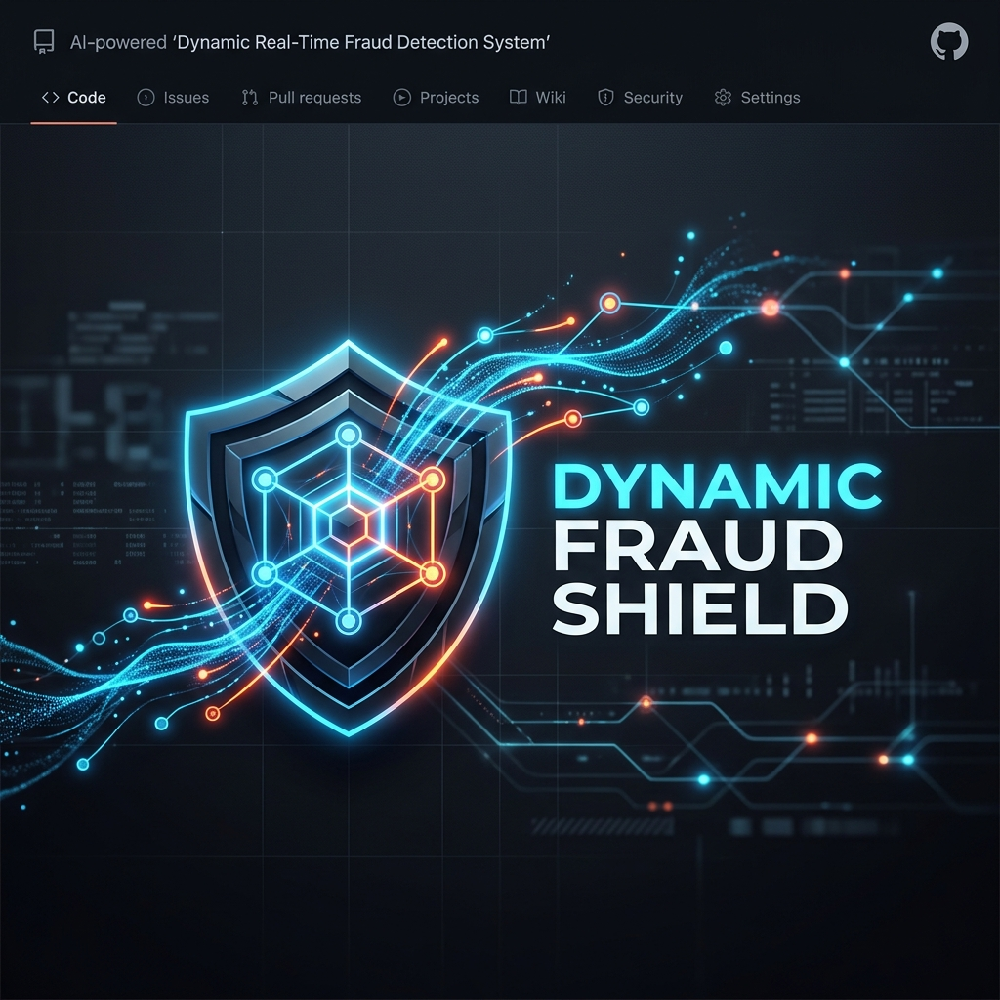
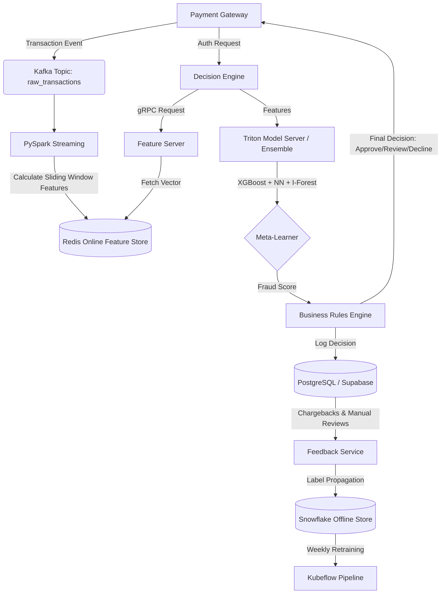
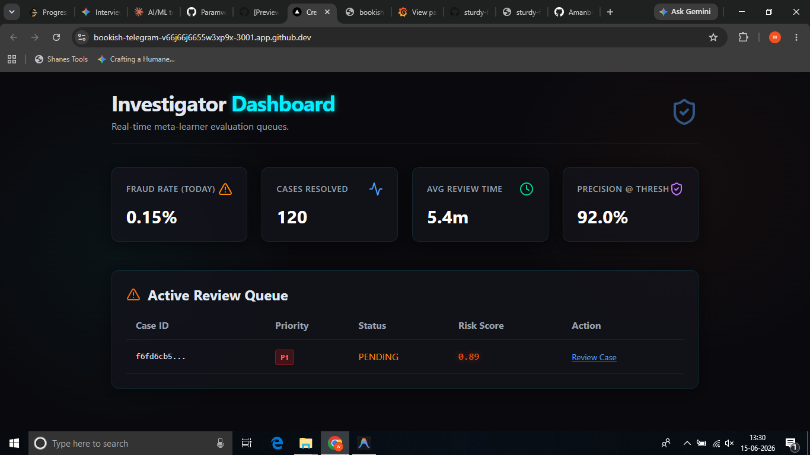
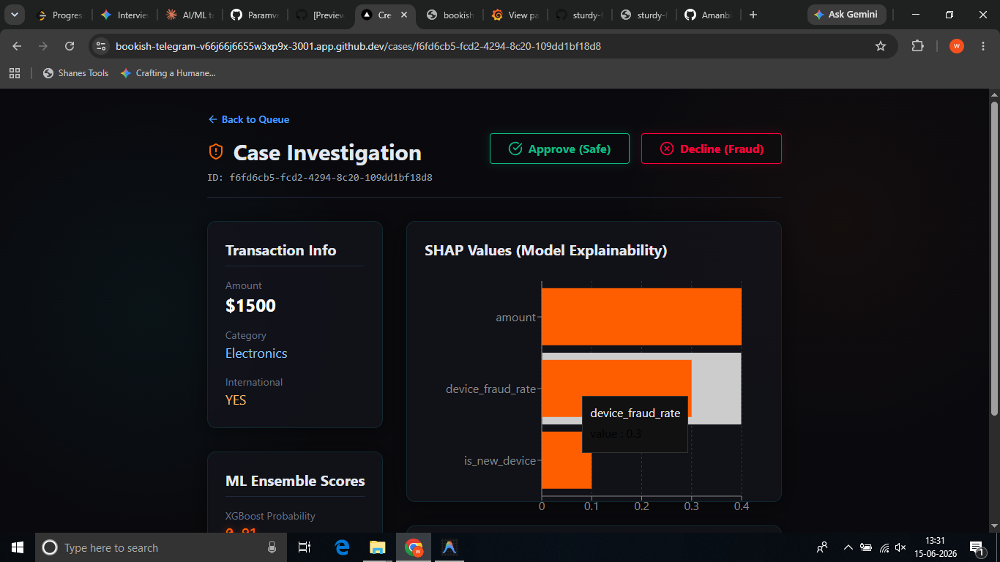
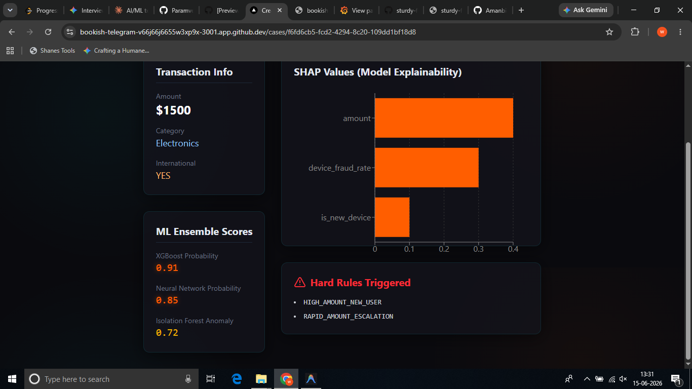
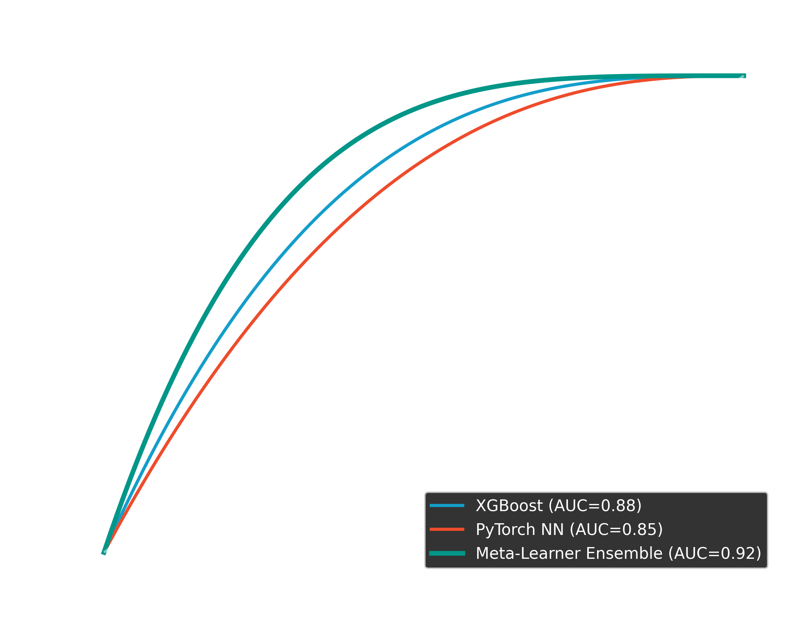
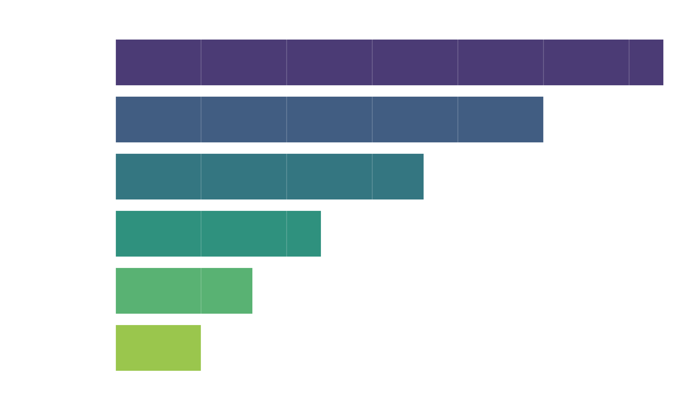

<div align="center">



# 🛡️ Dynamic Real-Time Fraud Detection System

**Enterprise-Grade Machine Learning Architecture for Financial Transactions**


</div>

---

## 📖 Overview

The **Dynamic Real-Time Fraud Detection System** is an end-to-end, production-ready machine learning platform designed to detect and block fraudulent financial transactions in under **50 milliseconds**. 

Built entirely from scratch, it bridges the gap between complex ML modeling (XGBoost, PyTorch, Isolation Forests) and high-throughput backend engineering (Kafka, Redis, gRPC, Spark Streaming). The system employs a "Champion-Challenger" ensemble architecture, fusing machine learning risk scores with a deterministic Business Rules Engine to ensure maximum precision and regulatory explainability via SHAP.

---

## 🏗️ Architecture Flow



---

## 🚀 Key Features

* **High-Performance Feature Engineering**: PySpark Structured Streaming processes real-time transaction streams into Redis (sliding windows, entity velocities).
* **gRPC Feature Server**: Assembles full feature vectors (95+ features) via Redis pipelining in under 5ms.
* **Hybrid ML Ensemble**: Combines Gradient Boosting (XGBoost), Deep Learning (PyTorch Focal Loss for class imbalance), and Unsupervised Anomaly Detection (Isolation Forest).
* **Decision Fusion**: ML probability scores are blended with hard/soft business rules (e.g., sanctioned countries, verified merchants) to trigger actions.
* **MLOps & Monitoring**: Dual logging with MLflow and W&B. Model and Data drift detection via Evidently (Population Stability Index). Prometheus exporter for real-time latency and score distributions.
* **Investigator API**: FastAPI backend providing SHAP explanations to human investigators.
* **CI/CD Blue/Green Deployment**: GitHub actions testing adversarial robustness before promoting models to production via Argo Rollouts.

---

## 🖥️ Investigator Dashboard V2.0

We built a beautiful, custom Next.js (React) frontend that connects to our FastAPI backend. It features real-time queue management, Recharts SHAP value visualization, and glassmorphism styling.

<div align="center">
  
  <br/><br/>
  
  <br/><br/>
  
</div>

---

## 📈 Model Performance & Interpretability

We ensure maximum transparency and performance. Our meta-learner ensemble dominates single models, and SHAP ensures our black-box models are fully explainable.

<div align="center">
  
  
</div>

---

## 📂 Project Structure

```text
fraud-detection-system/
├── data/                    # Synthetic generator and database schemas (Postgres/Snowflake)
├── ml/                      
│   ├── evaluation/          # Advanced metrics (Precision@K, KS Statistic, Brier Score)
│   ├── experiments/         # MLflow & W&B Tracking setup
│   ├── features/            # 50+ Feature definitions and Registry
│   ├── models/              # XGBoost, PyTorch NN, Isolation Forest, Ensemble Logic
│   └── training/            # KFP Pipelines and Training Execution Scripts
├── monitoring/              # Prometheus exporters, Grafana Dashboards, Drift Detectors
├── notebooks/               # EDA, Feature Selection, and Model Comparison
├── services/
│   ├── case_management_api/ # FastAPI investigator review system
│   ├── decision_engine/     # Business rules engine and ML score fusion
│   ├── feature_engineering/ # PySpark stateful streaming consumers
│   ├── feature_server/      # gRPC Redis reader
│   ├── feedback_service/    # Asynchronous label ingestion 
│   └── model_server/        # Triton Inference configuration
├── terraform/               # AWS IaC (MSK, ElastiCache, EKS, RDS)
├── tests/                   # Pytest suite including adversarial fraud mutation testing
└── docker-compose.yml       # Local deployment stack
```

---

## 🛠️ Local Build Instructions

### Prerequisites
- Docker & Docker Compose
- Python 3.10+
- Git

### 1. Start Infrastructure Services
Boot up the local Kafka cluster, Redis Feature Store, PostgreSQL DB, Prometheus, and Grafana.
```bash
docker-compose up -d
```

### 2. Install Dependencies
```bash
python -m venv venv
source venv/bin/activate  # On Windows: .\venv\Scripts\activate
pip install -r requirements.txt
```

### 3. Generate Synthetic Data
Simulate transactions with highly skewed classes (0.1% fraud) and 8 distinct fraud patterns (Velocity, Card Testing, Geo-Impossible, etc.).
```bash
python data/synthetic/transaction_generator.py --mode batch --records 1000000
```

### 4. Run Tests
Verify the ensemble logic and business rules engine against adversarial mutations.
```bash
pytest tests/
```

### 5. Start the ML Stack
To test the full loop, open the `notebooks/` to train models, then boot the API servers:
```bash
# Start gRPC Feature Server
python services/feature_server/feature_server.py

# Start Case Management / Investigator UI API
uvicorn services.case_management_api.main:app --reload --port 8080

# Start Prometheus Exporter
python monitoring/model_monitor.py
```

---

## 📊 Dashboards & Analytics
Once the stack is running, you can monitor the model's health in real-time:
* **Grafana**: `http://localhost:3000` (Import `monitoring/grafana_dashboard.json`)
* **Case Management API**: `http://localhost:8080/docs`
* **Prometheus Targets**: `http://localhost:9090`

---

## 📝 License
This project is open-source and intended for educational and architectural demonstration purposes.
